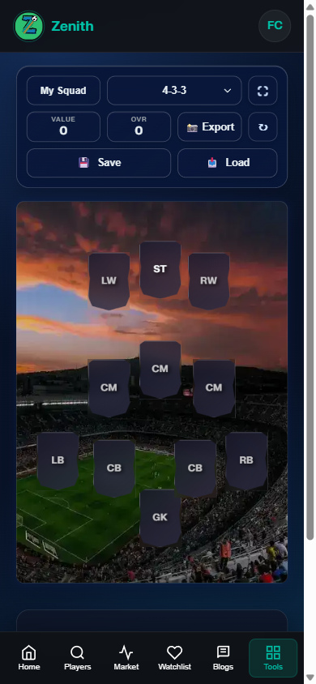
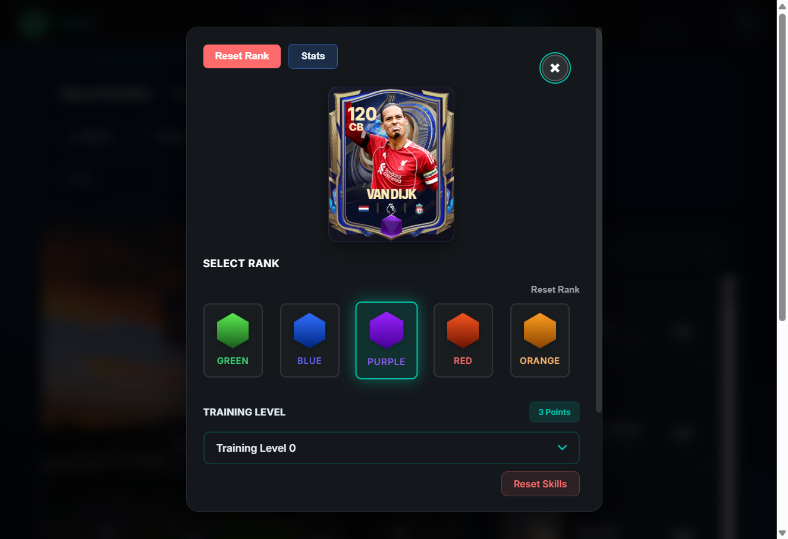
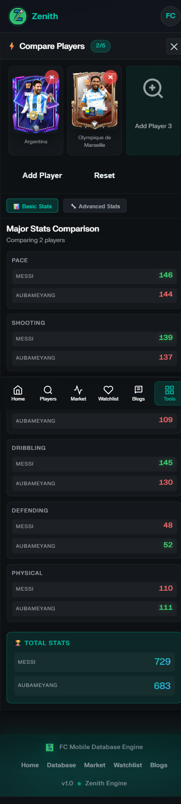
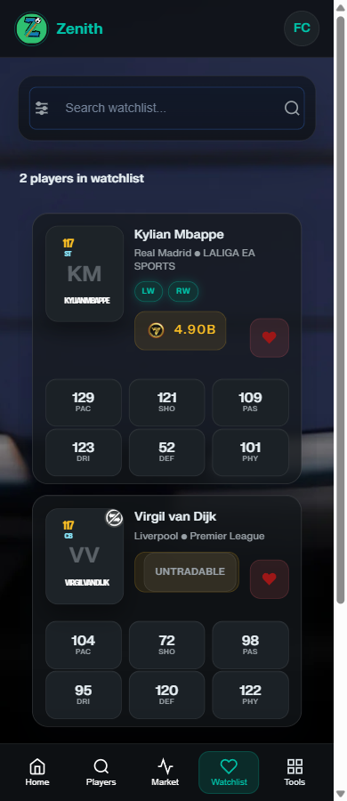

# ZenithFCM — High-Performance FC Mobile Database, Squad Builder, Redeem Codes & Player Comparison Hub

**[ZenithFCM](https://zenithfcm.com)** is a comprehensive, high-performance platform for **FC Mobile / EA FC Mobile players**. Engineered for speed and precision, we provide a production-grade toolset for competitive scouting, real-time market tracking, and squad optimization.

---

## 📖 Table of Contents
- [⭐ Support ZenithFCM](#-support-zenithfcm)
- [💎 Why ZenithFCM?](#-why-zenithfcm)
- [🎯 Popular Use Cases](#-popular-use-cases)
- [👥 Built For](#-built-for)
- [🛠️ Explore ZenithFCM](#-explore-zenithfcm)
- [🚀 Key Features](#-key-features)
- [📈 SEO & Data Credibility](#-seo--data-credibility)
- [🗺️ Roadmap](#️-roadmap)
- [🤝 Community & Feedback](#-community--feedback)
- [🖼️ Visual Preview](#-visual-preview)
- [⚔️ Competitor Comparison](#-competitor-comparison)
- [💻 Tech Stack](#-tech-stack)
- [🌟 Our Mission](#-our-mission)
- [🏁 Get Started](#-get-started)

---

## ⭐ Support ZenithFCM

If you find ZenithFCM useful for your FC Mobile journey, please consider giving this repository a **Star**! Your support helps us innovate, expand our data capabilities, and continue building the best tools for the community.

---

## 💎 Why ZenithFCM?

ZenithFCM delivers a modern, data-driven experience by prioritizing performance and mobile-first engineering.

*   **⚡ High-Performance:** Powered by Next.js 14 for near-zero latency scouting and navigation.
*   **📱 Mobile-First UI:** A premium, responsive interface designed specifically for the global mobile community.
*   **🎯 Production-Grade Data:** Accurate **FC Mobile player stats**, traits, and attributes sourced from our real-time data infrastructure.
*   **🕒 Real-Time Updates:** A reliable source for active **FC Mobile redeem codes** and market shifts.
*   **🏆 Professional Tools:** Advanced logic for team chemistry, rank-ups, and training simulations.

---

## 🎯 Popular Use Cases

ZenithFCM is optimized for the most common search intents and high-level player needs:

- **Scout the Meta:** Find the **FC Mobile best players** with advanced filters, OVR rankings, and attribute-level scouting.
- **Claim Rewards:** Instantly track and claim the latest **FC Mobile redeem codes** (**kode redeem fc mobile**) before they expire.
- **Optimize Chemistry:** Use our **FC Mobile squad builder** to visualize and maximize team performance with real-time chemistry calculations.
- **Make Market Moves:** Monitor the **FC Mobile market tracker** to buy low and sell high with deep historical price data.
- **Win the Comparison:** Use the **FC Mobile compare players** tool to make data-driven decisions between top-tier cards.
- **Stay Informed:** Read professional **FC Mobile blogs**, guides, and expert rankings.

---

## 👥 Built For

ZenithFCM is the professional home for every type of FC Mobile enthusiast:

*   **🏆 Competitive Players:** Min-maxing stats and finding the definitive best players for H2H and VSA dominance.
*   **📈 Market Traders:** Monitoring price refreshes and historical trends to build market wealth.
*   **🏗️ Squad Builders:** Experimenting with formations and maximizing team chemistry for the ultimate lineup.
*   **🦊 Meta Hunters:** Staying ahead of the curve with the latest card releases, patch updates, and redeem codes.
*   **🎮 Casual Users:** Quick scouting and easy access to the most reliable FC Mobile tools.

---

## 🛠️ Explore ZenithFCM

| Feature | Description | Link |
| :--- | :--- | :--- |
| **🏠 Homepage** | The central hub for FC Mobile tools, news, and trending players. | [Visit](https://zenithfcm.com) |
| **🎁 Redeem Codes** | Get the latest active FC Mobile redeem codes. | [Claim Now](https://zenithfcm.com/fc-mobile-redeem-codes) |
| **🔍 Player Database** | Search and filter the full EA FC Mobile players list with precision. | [Scout](https://zenithfcm.com/players) |
| **🏗️ Squad Builder** | Create, optimize, and share your dream team lineups. | [Build](https://zenithfcm.com/squad-builder) |
| **⚖️ Compare Tool** | Side-by-side FC Mobile player comparison and stat-stacking. | [Compare](https://zenithfcm.com/compare) |
| **✍️ Blogs & Guides** | Pro tips, market insights, and elite player rankings. | [Read](https://zenithfcm.com/blogs) |

---

## 🚀 Key Features

### 🎁 FC Mobile Redeem Codes Center
Our real-time tracker ensures you never miss a reward. We aggregate official releases and community-verified **FC Mobile redeem codes** into a single, lightning-fast dashboard.

### 🔍 Production-Grade Player Database
A highly responsive **FC Mobile database** designed for speed. Access granular insights into **FC Mobile player stats**, including work rates, skill moves, weak foot accuracy, and hidden traits.

### 🏗️ Professional Squad Builder
A state-of-the-art **FC Mobile squad builder** that allows you to simulate formations, visualize **team chemistry**, and export high-resolution lineups for social sharing.

### 📈 Market Tracking & Analytics
Data-driven trading starts here. Our **FC Mobile market tracker** provides historical price tracking and refresh timers to ensure you always have the competitive advantage.

### ⚖️ Player Comparison Tool
The **FC Mobile compare players** tool stacks cards side-by-side, accounting for training levels, rank-ups, and skill boosts to help you make the right investment.

---

## 📈 SEO & Data Credibility

ZenithFCM is engineered with an emphasis on **EEAT** (Experience, Expertise, Authoritativeness, and Trustworthiness):

- **Advanced Structured Data:** Every player, blog, and tool page utilizes SEO-optimized architecture and structured data for rich search results and fast indexing.
- **High-Speed Discoverability:** Optimized SSR/ISR architecture ensures that new players and redeem codes are indexed by search engines almost instantly.
- **Real-Time Data Infrastructure:** We utilize a robust, production-grade architecture designed for high accuracy across all player stats and market prices.

---

## 🗺️ Roadmap

We are constantly evolving to provide the most powerful tools for the FC Mobile community:

- [ ] **AI-Powered Recommendations:** Smart squad suggestions based on your playstyle and budget.
- [ ] **Advanced Market Predictions:** Predictive analytics for upcoming market trends and price shifts.
- [ ] **Expanded Player Analytics:** Deeper attribute visualizations and "meta-rating" scores.
- [ ] **Community Squad Sharing:** A public gallery to discover, upvote, and clone community-built squads.
- [ ] **Enhanced Automation:** Faster verification and notification systems for new redeem codes.

---

## 🤝 Community & Feedback

ZenithFCM is built for the community. We value your insights and feedback:

- **Feature Suggestions:** Have an idea for a new tool? Let us know!
- **Feedback:** Report bugs or suggest UI improvements to help us polish the experience.
- **Insights:** Share your market tips or squad strategies to be featured in our blog section.

Join our growing community of thousands of players and help us shape the future of ZenithFCM.

---

## 🖼️ Visual Preview

   
  
  
<em>Professional Squad Builder interface optimized for mobile.</em>

   
  
  
<em>Pitch visualization with rank and training simulations.</em>

   
  
  
<em>Side-by-side player comparison with attribute-level detail.</em>

   
  
  
<em>Real-time player tracking and market watchlist.</em>

---

## ⚔️ Competitor Comparison

ZenithFCM is the **modern, mobile-first alternative** to legacy tools like renderz, fc mobile forum. While other platforms may suffer from slow load times or outdated interfaces, ZenithFCM is 100% dedicated to the next-generation mobile experience:

- **⚡ Built for Speed:** Next-generation caching and ISR make us faster and more reliable.
- **📱 Modern Standards:** A premium UI designed for modern UX standards, offering a seamless experience across all devices.
- **🎯 Accurate:** Real-time synchronization with mobile-specific data points and refresh timers.
- **🛡️ Reliable:** A stable and frequently updated source for FC Mobile redeem codes.

---

## 💻 Tech Stack

*   **Framework:** [Next.js 14](https://nextjs.org/) (App Router) for industry-leading SEO and performance.
*   **UI Core:** React 18 with high-efficiency Vanilla CSS modules for maximum responsiveness.
*   **Data Architecture:** Real-time infrastructure and PostgreSQL for authoritative content management.
*   **Performance Engine:** Advanced Hybrid SSG/ISR architecture for instant page delivery across our player catalog.
*   **Processing:** [Sharp](https://sharp.pixelplumbing.com/) for dynamic image optimization and [Chart.js](https://www.chartjs.org/) for market data visualization.

---

## 🌟 Our Mission

ZenithFCM was built by players, for players. We believe the FC Mobile community deserves a professional-grade platform that is as competitive and fast-paced as the game itself. Our mission is to provide the most accurate, accessible, and high-speed tools to every user, helping them dominate the pitch and the market.

---

## 🏁 Get Started

**Join thousands of FC Mobile players using ZenithFCM to scout smarter, build better, and dominate faster.**

1.  **Visit [ZenithFCM.com](https://zenithfcm.com)**
2.  **Claim your [Redeem Codes](https://zenithfcm.com/fc-mobile-redeem-codes)**
3.  **Optimize your lineup in the [Squad Builder](https://zenithfcm.com/squad-builder)**

---

*Built with ❤️ for the FC Mobile Community. ZenithFCM is not affiliated with EA Sports.*
